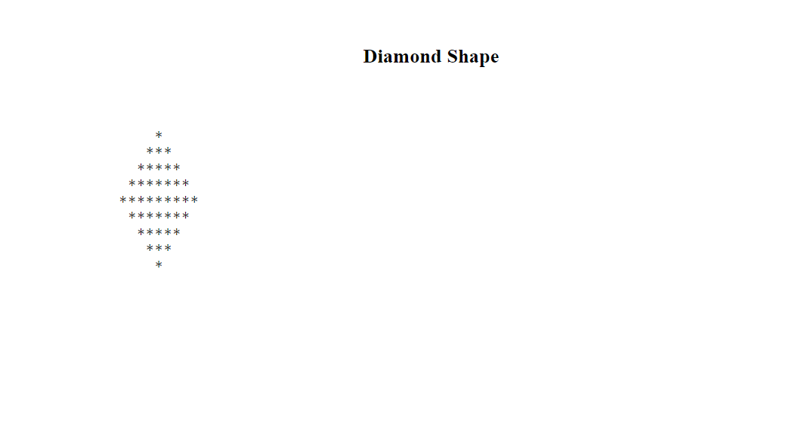

# Tutorial 01

## Make the diamond shape and check Validation.

## Folder Structure

```
.
├── ccs/
│   ├── reset.css
│   └── style.css
├── demo/
│   └── preview.png
├── index.php
└── README.md
```

