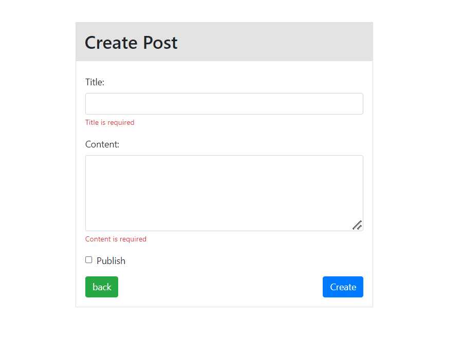
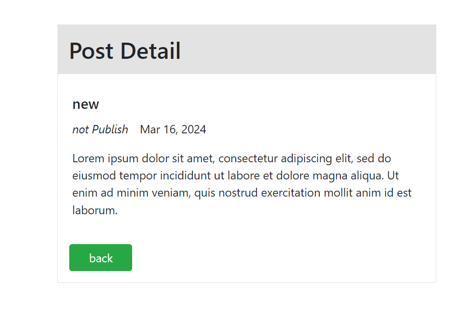

# Tutorial 08

## CRUD with post table

## Table

posts
- id (unsigned int, auto increment, primary key)
- title (varchar, length:255)
- content (text)
- is_published (boolean)
- created_datetime (timestamp, default value: current timestamp)
- updated_datetime (timestamp, default value: current timestamp)

CURD
- C  (Create)
- U  (Update or Edit)
- R  (Read or View or List)
- D  (Delete (confirm))

## Folder Structure
```
.
css/
├── reset.css
└── style.css
demo/
├── preview_post_list.png
├── preview_post_create.png
├── preview_post_detail.png
├── preview_post_edit.png
└── preview_post_delete_confirm_alert.png
libs/
create.php
detail.php
edit.php
index.php
README.md
```

## Validation Rules
- Title field is required
- Content field is required

<hr>

## Post Create Design


## Post Delete Confirm Alert Design


## Post Detail Design



## Post Edit Design


## Posts List Design


